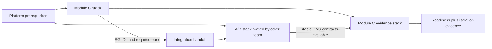

# Module C AWS deployment and Well-Architected evidence

Source rubric: `docs/references/wellarchitected-framework.pdf` and the project skill
`.agents/skills/aws-well-architected-review`.

## Ownership and deployment order

Module C has no Terraform dependency on A/B resources and never mutates an A/B security
group. Its only remote configuration is the stable DNS contract for ledger `4001`, policy
`4002`, and chain gateway `4004`. Those names may have no registered tasks during the first
Module C deployment.

Deployment is deliberately two-phase:

1. **Standalone Module C** — apply `infra/module-c`. ECS liveness and the dashboard work
   while A/B is absent; authenticated readiness returns `503`, and `POST /run` returns the
   shared retryable `DEPENDENCY_UNAVAILABLE` envelope before creating a run.
2. **Post-A/B evidence** — the A/B owner consumes Module C's
   `dependency_ingress_handoff` output and adds the matching ingress rules in the A/B-owned
   stack. Then apply `infra/module-c-integration` to register the one-off probe task and run
   the live positive/negative network test.



The A/B owner remains exclusively responsible for policy-to-signer `4003` ingress and for
proving the signer has no broader ingress. Module C never receives a signer endpoint in its
service definition.

## Standalone Module C deployment

1. Confirm the AWS identity and Region. The account number is discovered automatically; do
   not type `ACCOUNT` into an ECR hostname:

   ```sh
   export AWS_REGION=ap-southeast-1
   aws sts get-caller-identity
   ```

2. Build and publish images. The script derives
   `<account>.dkr.ecr.<region>.amazonaws.com`, creates the two ECR repositories if they do
   not exist, enables immutable tags and scan-on-push, and prints digest-pinned image values
   for the Terraform file:

   ```sh
   scripts/publish-module-c-images.sh
   ```

3. For the self-contained path, copy the standalone example to a local file outside the
   repository. This mode creates Module C's VPC, two public and two private subnets across
   two Availability Zones, NAT, private AWS endpoints, ECS cluster, private Cloud Map
   namespace, KMS-encrypted logs, Secrets Manager token, SSM wallet parameter, ALB log
   bucket, SNS topic, ALB, and CloudFront HTTPS route. It does not create or mutate A/B.
   The following is a command, not a literal path to pass to Terraform:

   ```sh
   cp infra/module-c/terraform.standalone.tfvars.example /tmp/module-c.tfvars
   ${EDITOR:-vi} /tmp/module-c.tfvars
   ```

   Paste the digest-pinned image values printed by the publish script. Replace every
   `replace-me` and example account. Leave the zero wallet only while A/B is absent; replace
   it before live settlement. The deployment wrapper rejects an untouched example file.

   To deploy into an existing platform instead, start from
   `infra/module-c/terraform.tfvars.example`, set `create_foundation = false`, and provide
   its platform resource IDs. Neither mode accepts an A/B security-group ID or signer value.

4. Keep `https_egress_cidrs = []` for the standalone A/B-absent deployment. Before a live
   card or merchant integration, resolve only approved StraitsX and merchant HTTPS
   endpoints into `/32` values. `0.0.0.0/0` is rejected. CDN addresses can change, so
   re-resolve immediately before a controlled demonstration; production should use
   inspected egress.
5. Test, plan, review, and apply using the real `/tmp/module-c.tfvars` file created above.
   Do not substitute a documentation placeholder path:

   ```sh
   corepack pnpm typecheck
   corepack pnpm test
   scripts/deploy-module-c.sh module-c /tmp/module-c.tfvars
   scripts/deploy-module-c.sh module-c /tmp/module-c.tfvars --apply
   ```

6. Read the generated public URL and wait for all services:

   ```sh
   DASHBOARD_URL="$(terraform -chdir=infra/module-c output -raw dashboard_url)"
   ECS_CLUSTER_ARN="$(terraform -chdir=infra/module-c output -raw ecs_cluster_arn)"
   aws ecs wait services-stable --cluster "$ECS_CLUSTER_ARN" \
     --services straitsx-module-c-dashboard straitsx-module-c-orchestrator straitsx-module-c-fixture
   curl -fsS "$DASHBOARD_URL/api/health"
   curl -sS -o /tmp/module-c-ready.json -w '%{http_code}\n' "$DASHBOARD_URL/api/ready"
   ```

   `/api/health` must return `200`. Before A/B connects, `/api/ready` must return `503`, the
   UI must show `Waiting for ledger, policy, and chain gateway`, and Start Run must be
   disabled. This is a successful fail-closed standalone deployment, not an ECS failure.

7. Subscribe an owned address or incident destination to the SNS alarm topic and confirm the
   subscription. The optional `alarm_email` input creates an email subscription, but AWS
   will not deliver until the recipient confirms it. For production, set
   `alb_deletion_protection = true`, move Terraform state to an encrypted remote backend
   with locking, and deploy through a non-root federated role.

## A/B handoff and live integration

Give this output to the A/B owner:

```sh
terraform -chdir=infra/module-c output -json dependency_ingress_handoff
```

Their stack must add only the listed C source security groups to ledger `4001`, policy
`4002`, and chain gateway `4004`. After they return stable service DNS and evidence for the
non-stub signer and Module B acceptance gates, configure and apply the evidence stack:

```sh
cp infra/module-c-integration/terraform.tfvars.example /tmp/module-c-integration.tfvars
${EDITOR:-vi} /tmp/module-c-integration.tfvars
scripts/deploy-module-c.sh integration /tmp/module-c-integration.tfvars
scripts/deploy-module-c.sh integration /tmp/module-c-integration.tfvars --apply
```

Launch the probe with the exact Module C subnets and orchestrator security group. Supply the
signer hostname only as a one-off container override; it is not persisted in the Module C
service or probe task definition:

```sh
aws ecs run-task \
  --cluster "$ECS_CLUSTER_ARN" \
  --task-definition "$ISOLATION_PROBE_TASK_DEFINITION_ARN" \
  --launch-type FARGATE \
  --network-configuration "awsvpcConfiguration={subnets=[$PRIVATE_SUBNET_IDS],securityGroups=[$ORCHESTRATOR_SECURITY_GROUP_ID],assignPublicIp=DISABLED}" \
  --overrides '{"containerOverrides":[{"name":"probe","environment":[{"name":"SIGNER_HOST","value":"signer.internal"},{"name":"SIGNER_PORT","value":"4003"}]}]}'
```

Archive the task exit code and CloudWatch stream. A pass requires signer DNS to resolve,
ledger/policy/chain health to succeed, and TCP signer `4003` to fail from the exact
orchestrator security group.

## Six-pillar review

| Pillar | Status | Implemented evidence | Remaining gate |
|---|---|---|---|
| Operational excellence | partial | Separate standalone/integration states, versioned Terraform/Dockerfiles, health/readiness split, deployment rollback, CloudWatch logs/alarms, and deployment scripts (`OPS02`, `OPS05`, `OPS06`, `OPS07`, `OPS08`) | Alarm routing and rollback must be exercised in AWS. |
| Security | partial | Module C does not mutate A/B, signer information is absent from service/task definitions, private Fargate tasks use bounded flows, secrets, encrypted logs, immutable digest-pinned images, read-only/non-root containers, TLS, and an ECR publish gate that rejects critical/high findings (`SEC02`, `SEC03`, `SEC04`, `SEC05`, `SEC06`, `SEC09`) | A/B-owned ingress inspection, IAM simulation, and deployed isolation proof remain required. Module B must verify approval signatures. |
| Reliability | partial | Explicit remote contracts, independent deployment, graceful not-ready state, fail-closed run admission, multi-AZ ALB/dashboard, autoscaling, bounded timeouts and circuit-breaker rollback (`REL02`, `REL03`, `REL04`, `REL05`, `REL06`, `REL08`) | Orchestrator resumable context is process-local, so its service intentionally remains one task. Durable non-secret run storage is required before horizontal scaling or HA claims. A/B datastore backup/DR is external. |
| Performance efficiency | partial | Fargate CPU/memory parameters, ALB, dashboard target tracking (`PERF02`, `PERF04`, `PERF05`) | Load-test and tune task sizes/targets from metrics. |
| Cost optimization | partial | Parameterized sizing, dashboard demand scaling, 30-day log retention, tags (`COST01`, `COST03`, `COST04`, `COST06`, `COST09`) | Add budgets/cost anomaly alerts at the account layer and review NAT/egress costs. |
| Sustainability | partial | Fargate managed compute, dashboard demand scaling, bounded log lifecycle (`SUS02`, `SUS04`, `SUS05`) | Measure utilization; right-size and remove idle demo resources after capture. |

## Non-negotiable acceptance evidence

- Terraform validation alone is not deployment proof.
- ECS services healthy across configured AZs.
- Standalone `/api/health` is `200`; pre-integration `/api/ready` is `503` and a run returns
  `DEPENDENCY_UNAVAILABLE` without creating state.
- CloudWatch alarms deliver to an owned destination.
- Rollback/circuit breaker tested with a deliberately unhealthy image in a non-production environment.
- Signer DNS resolves while TCP/HTTP 4003 fails from the orchestrator security group.
- Policy 4002, ledger 4001, chain gateway 4004, DNS, and approved HTTPS destinations succeed.
- No signer URL appears in the orchestrator task definition.
- No signer URL appears in the isolation task definition; it is supplied only to the one-off
  task override after A/B handoff.
- Logs and ALB evidence contain no card data, authorization headers, approval signatures, or iframe URLs.
